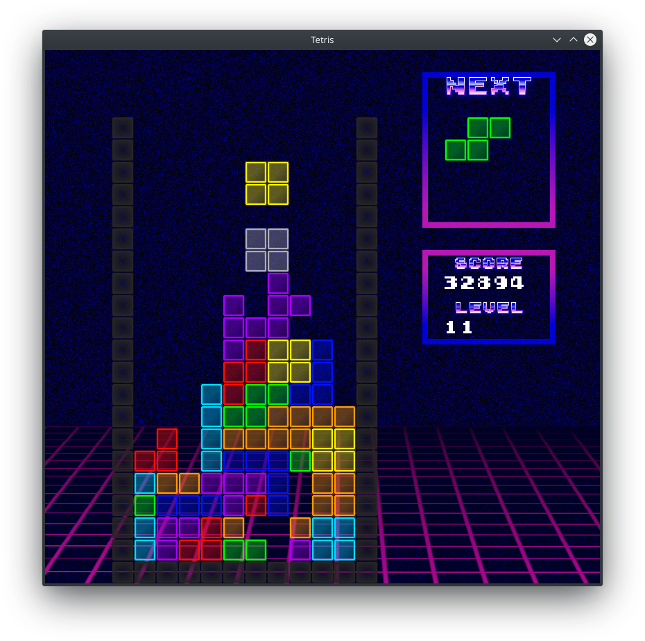
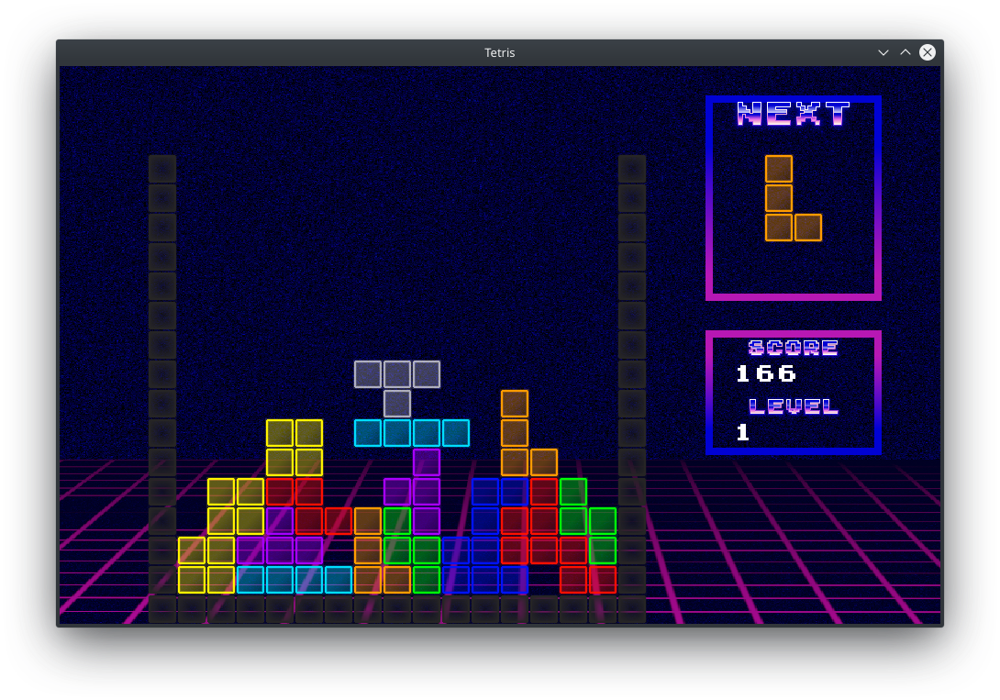

## Tetris

Tetris clone written in C++ using SFML library as a univeristy project.

##Includes:
* Ability to resize the game board
* Functional scoreboard
* Great music!

##Controls:
* Left/right arrows - piece moving
* Up/down arrows - piece rotation
* Space - fast fall
* P - pause while in game

**Have fun!**

##Screenshots:

